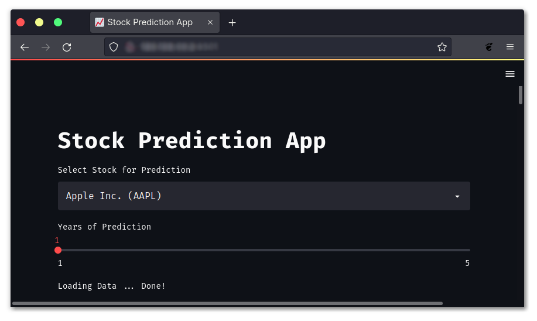

<h1 align="center">Stock Predictions App</h1>

<p align="center">using Python and <a href="https://streamlit.io/">Streamlit</a></p>

<p align="center">  </p>

<!-- 
## Setup

- Create Virtual Enviroment
```sh
python -m venv venv
```
-->
<!-- 
- Upgrade `pip`
```sh
python -m pip install --upgrade pip
```
-->
<!-- 
- Install Required Packages/Modules
```sh
python -m pip install streamlit prophet yfinance plotly
```
-->
<!--
## Run

```sh
python -m streamlit run main.py
```
-->
